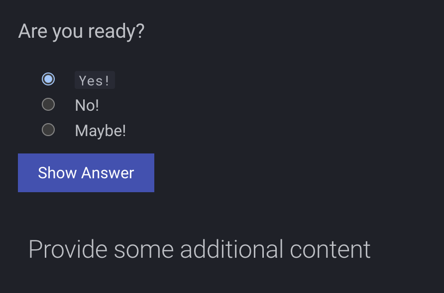
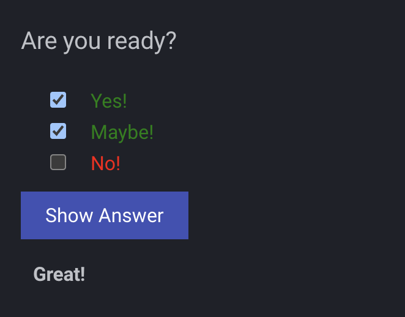

# MkDocs Quiz Plugin

## [Demo](https://skyface753.github.io/mkdocs-quiz/)

## Create your first quiz

```bash
<?quiz?>
question: Are you ready?
answer-correct: Yes!
answer: No!
answer: Maybe!
content:
<h2>Provide some additional content</h2>
<?/quiz?>
```

> **Info** The answers can get styled with HTML (like `<code>Yes!</code>`)

> **Warning** The quiz content needs to be valid **_HTML_**

## Multiple choice

You can also create a multiple choice quiz, by providing multiple answers as correct.

```bash
<?quiz?>
question: Are you ready?
answer-correct: Yes!
answer: No!
answer-correct: Maybe!
content:
<h2>Provide some additional content</h2>
<?/quiz?>
```

## Screenshots

### Quiz (single choice)



### Quiz (multiple choice)



## Disable for a page

```markdown
---
quiz: disable
---
```
